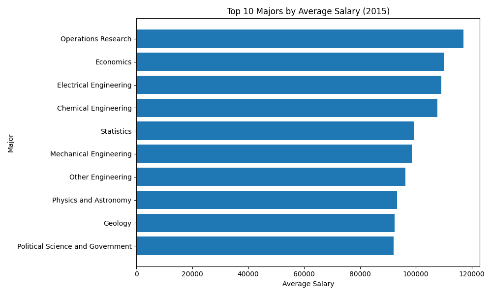
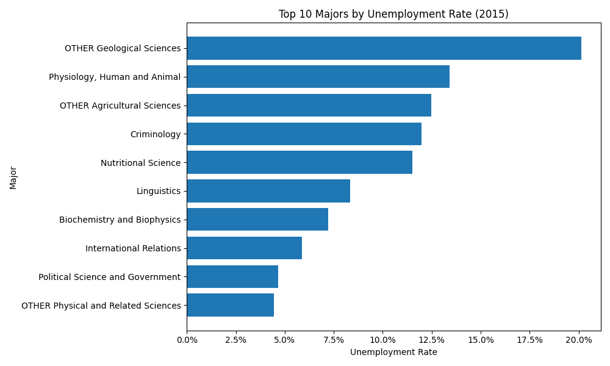

# Choosing a Major: Pay, Employment, and What the Data Leaves Out

**This is the overview of the CS-130 Project.**

Growing up, the pressure to choose the “right” path in life can feel overwhelming. From a young age, many people are told that they need to start thinking seriously about their future. Whether it is reminders like “It’s time to focus,” “College is right around the corner,” or “Make sure you pick the right major,” the message is often the same: the decisions you make now will shape the rest of your life. Because of this, choosing a college major can feel like one of the most important choices a person will ever make.

Many people assume that a major directly determines someone’s future success, income, job opportunities, and even happiness. However, this belief is worth looking at more closely. I wanted to explore this idea by analyzing a dataset that looks at salaries and employment rates in comparison to the majors of college students. Through this data, I hope to better understand whether the major someone graduates with truly has a strong connection to their career outcomes, or if the relationship is more complicated than people often make it seem.

## The Salary Gap (Top Majors by Average Salary)

It is clear from the data that some majors lead to higher average salaries than others, which helps explain why so many students feel pressure to pick the “right” one. When certain fields appear to offer a stronger financial future, it becomes easy to see why their major choice is often treated like a life-defining, stressful decision. This chart reinforces the belief that what a person studies in college can have a major influence on their career earnings later in life. For students already worried about tuition, debt, and job stability, this type of salary gap can feel almost impossible to ignore.

At the same time, this chart is about more than just numbers. The gap between the higher paying majors and the latter shows how strongly society connects success with income. Majors tied to technical or specialized careers may seem like the safest options, while others can appear less valuable simply because they pay less. This can create a lot of pressure for students to prioritize salary over personal interests, strengths, or long-term happiness.

## Money doesn't tell the full story
While a high salary is obviously a priority for many, strong pay in a specific major does not guarantee job stability. A major may look inticing because of it's average salary numbers, but this does not tell the complete story. There will always be a level of skill, risk, and opportunity that comes with attempting to earn a degree in a more technical or specialized field. 

This adds an important layer to the story because it challenges the idea that the highest-paying majors are automatically the best. Some majors may lead to lower salaries but offer more stable employment, while others may show strong pay for the people who are employed without guaranteeing the same level of job access for everyone. That makes the relationship between major and future success much more complicated than a simple salary ranking.

## Different Majors, Different Salary Paths

Looking at salary over time adds something the other two charts do not: perspective. A one-year ranking can make the differences between majors feel fixed and simple, but this line graph shows that career pay is something that develops over time. Some majors remain ahead year after year, while others rise more slowly and never fully close the distance. That makes the conversation around major choice feel less like a snapshot and more like a long-term pattern.

This matters because students are often asked to make major decisions long before they have a full picture of how those choices play out across time. A field that looks promising in one moment may not tell the whole story of its long-term earnings path, and a major that starts lower may still show steady growth. By comparing several majors over multiple years, the chart highlights that the relationship between college major and salary is persistent, but not identical across every field. In that way, the graph pushes the article beyond the question of “which major pays the most” and toward a bigger question: how do different majors shape financial trajectories over the course of a career?

